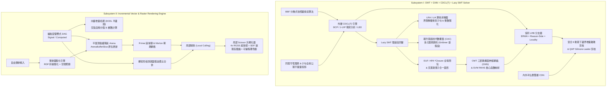

# MoonBit Unified Engine: OMT + GNN + CDCL(T) + Lazy SMT Solver & Incremental Vector/Raster Rendering System

[](https://www.moonbitlang.com)
[](LICENSE)
[](#%E5%BF%AB%E9%80%9F%E9%96%8B%E5%A7%8B%E8%88%87%E6%B8%AC%E8%A9%A6)

本倉庫以最新穩定版 **MoonBit** 語言及官方標準庫 (`moonbitlang/core`) 實現兩大高階核心引擎：

1. **自研 OMT 內層 + 圖神經網絡 (GNN) 內層 + CDCL(T) 外層嵌入 Lazy SMT 統一求解器**
   - 內層 OMT 聯動 **SVM 再生核希爾伯特空間 (RKHS) 核心函數映射**、**HPA 線性時間全等閉包 (`*Closure`)**、**克萊斯合一圖形 (Kleisli Unification Graph, EUF)** 與 **BBF 分散式快照變換演算法**
   - **內外半幺群雙層 CDN 解耦對映 QAP 指派子句 CNF**
   - **協同 LRB 混合 6 動態下邊界增量離散剪枝**、**QAP 增量離散剪枝** 與 **增量最優解引理（記錄 incumbent 並加 blocking clause；唔係最小解釋）**
   - **環升態圓柱代數覆蓋 (CAC) 理想歸約**、**Lazy SMT + CDCL(T) 同態守恆理想** 與 **疊加協同窮舉上界歸因子句全射公理不變量約束投影**
   - 完整支援 **Lazy SMT + LRA (線性實數算術) + LIA (線性整數算術) + EUF (未解釋函數等詞)**

2. **高性能向量增量拓撲與細粒度局部光柵渲染系統**
   - **向量增量拓撲 (DCEL 半邊平面圖)**、**細粒度響應式（dirty 標記推送 + 依賴序重算，無閃爍依賴圖）**
   - **動態 R-tree 區域樹**、**Morton Z-Order 稀疏網格**、**筆跡叢集化 (RDP 簡化 + 空間切向親和聚類)**、**髒矩形檢測與面積浪費比合併**
   - **平面頂點緩衝區 (Flat VBO/IBO Arena：上載時一次轉換入連續浮點陣列，之後原位切片更新)**、**雙線性插值 SDF 有向距離場紋理圖集**、**可編程頂點/片段著色器**
   - **局部剔除 (Local Culling)**、**光柵與局部 Scissor 光柵**、**4x RGSS 旋轉網格超採樣 + SDF 邊緣平滑反鋸齒** 與 **幀間增量渲染管線**

---

## 系統架構總覽



---

## 專案目錄與模組說明

```text
.
├── moon.mod                         # MoonBit 模組設定檔
├── moon.pkg                         # 根套件依賴設定
├── solver_tunables.mbt              # 集中數值參數 (sentinels / tolerances / budgets / 布局常數)
├── types_and_algebra.mbt            # 布爾/算術基礎型別、內外半幺群雙層 CDN 解耦映射、QAP 指派 CNF 生成
├── euf_hpa_kleisli_bbf.mbt          # HPA 線性時間 *Closure 全等閉包、Kleisli 範疇合一圖、BBF 分散式快照
├── gnn_svm_kernel.mbt               # OMT 異構圖神經網絡 (GNN) 消息傳遞、SVM RKHS 高斯/多項式/EUF 混合核
├── lrb_qap_pruning.mbt              # 協同 LRB 分支、混合 6 動態下界、QAP 增量離散剪枝、自適應最優解引理
├── cac_ideal_and_invariants.mbt     # 環升態圓柱代數覆蓋理想歸約、同態守恆理想、全射公理上界約束投影
├── lazy_smt_omt_solver.mbt          # LRA/LIA 求解器、1-UIP 衝突分析、Lazy SMT + CDCL(T) + OMT 主引擎
├── render_topology_reactive.mbt     # 向量增量拓撲 (DCEL 半邊圖、交點分裂) 與細粒度響應式依賴圖
├── render_spatial_rtree_grid.mbt    # 動態 Guttman R-tree、Morton 稀疏網格、RDP 筆跡叢集化、髒矩形合併
├── render_vbo_sdf_shader.mbt        # 平面 VBO/IBO 緩衝區、雙線性 SDF 紋理圖集、可編程頂點/片段著色器
├── render_rasterizer_pipeline.mbt   # 局部剔除、局部 Scissor 光柵、4x RGSS 反鋸齒、增量渲染主引擎
├── omt_cdcl_solver.mbt              # 5 大端到端基準測試與場景編排入口
├── omt_cdcl_solver_wbtest.mbt       # 白盒單元測試 (代數同態、HPA/Kleisli、GNN/SVM、LRB/Hybrid6、拓撲/R-tree/VBO)
├── omt_cdcl_solver_test.mbt         # 黑盒整合測試 (5 大端到端場景驗證)
└── cmd/main/
    ├── moon.pkg                     # CLI 執行檔套件設定
    └── main.mbt                     # CLI 主程式：執行全部 5 大基準場景並輸出遙測報告
```

---

## 核心演算法細節

### 1. OMT + GNN + CDCL(T) + Lazy SMT 求解器
- **內外半幺群雙層 CDN 解耦對映 (`DualLayerCDN`)**：外層布爾部分指派幺半群 $(\mathcal{M}_{\text{outer}}, \oplus, e_{\text{outer}})$ 到內層理論狀態半群 $(\mathcal{S}_{\text{inner}}, \otimes)$ 滿足同態律 $\Phi_{\text{CDN}}(\mathbf{a} \oplus \mathbf{b}) = \Phi_{\text{CDN}}(\mathbf{a}) \otimes \Phi_{\text{CDN}}(\mathbf{b})$。
- **HPA `*Closure` 與克萊斯合一圖形 (`HpaCongruenceClosure`, `KleisliUnificationGraph`)**：支援任意深度未解釋函數嵌套 $a \equiv^* b \implies f(f(a)) \equiv^* f(f(b))$ 的線性時間傳播與證明森林路徑追蹤（`explain_path` 回傳 sound 超集，非最小解釋），並在代換單子 Kleisli 範疇 $\mathcal{K}(T)$ 中透過 `occurs_in` 攔截非良基循環合一。
- **協同 LRB 混合 6 動態下邊界 (`LrbBrancher`, `Hybrid6DynamicLowerBound`)**：融合 $LB_1$（LRA 連續鬆弛）、$LB_2$（LIA 整數緊化）、$LB_3$（QAP Gilmore-Lawler 下界）、$LB_4$（SVM RKHS 譜範數下界）、$LB_5$（EUF 全等耦合下界）、$LB_6$（GNN 校準神經下界）進行增量離散剪枝。$LB_4$–$LB_6$ 係校準啟發式，只會將融合下界收緊到唔超過 $LB_1$–$LB_3$ 嘅合理下界；真正決定剪枝嘅係後三者。
- **環升態 CAC 理想歸約與同態守恆理想 (`CylindricalAlgebraicCovering`, `HomomorphicConservationIdeal`, `SurjectiveAxiomProjector`)**：在 $\mathbb{Q}[x_1,\dots,x_n]$（GrLex 序）上計算 Buchberger S-多項式與多元理想除法歸約，驗證歸結步在布爾商環理想中的同態守恆性，並校驗 9 類公理來源的全射覆蓋；認證失敗次數同各類覆蓋率會經 CLI 報告輸出（正常失敗次數為 0）。

### 2. 向量增量拓撲與增量光柵渲染系統
- **向量增量拓撲 (`VectorTopologyGraph`)**：插入新線段時自動檢測與既有活躍半邊的內部交點，原位分裂半邊對 (`split_edge_incremental`) 並維護平面圖繞數與歐拉示性數。
- **細粒度響應式與平面 VBO (`FineGrainedReactiveGraph`, `FlatVertexArena`)**：單一圖元平移信號觸發時，直接對 `ArenaBufferSlice` 對應的連續浮點陣列區間執行原位更新 (`translate_slice_in_place`)，唔需要重新上載或者重新分配切片。
- **R-tree + Morton 稀疏網格局部剔除與局部 Scissor 光柵 (`IncrementalRenderEngine`)**：合併新舊包圍盒為緊湊髒矩形後，求取 R-tree 與稀疏網格查詢交集以剔除髒區外圖元，並僅在髒矩形 Scissor 視窗內執行 **4x RGSS 旋轉網格超採樣 + SDF 雙線性平滑反鋸齒** 光柵化。

### 3. 誠實聲明與已知限制（2026-10 代碼審查）

以下如實記錄能力邊界，避免文檔描述超越實現：

- **LB4 / LB5 / LB6（SVM 譜範數、EUF 耦合、GNN 校準）係啟發式**：三者都會被夾在 LB1–LB3 構成嘅可靠下界之內，所以 `fused_lower_bound` 永遠唔會超過可靠上確界，剪枝保持 admissible；亦因為咁，實際決定剪枝嘅只有 LB1（LRA 連續鬆弛）、LB2（LIA 整數緊化）同 LB3（QAP 下界），LB4–LB6 只作遙測輸出。
- **算術理論求解器係區間界限傳播**，唔係 simplex；衝突子句由界限嘅 reason 集合（已做傳遞閉包）同約束 guard 構成。標籤為 `LraFarkasAxiom` 嘅只係「實數界限衝突」分類，程式**冇**構造或驗證顯式 Farkas 證書。
- **CAC 只對以 `add_constraint` 註冊嘅多項式約束生效**：統一求解器預設冇註冊任何多項式約束，場景 [3] 係用獨立 API 直接驗證理想歸約。`compute_spoly`（Buchberger S-多項式）目前只由白盒測試覆蓋，未參與歸約路徑；歸約假設註冊嘅生成元已構成 Gröbner 基（示範場景嘅 {g1, g2} 已滿足）。
- **Dual-Layer CDN 對映 (`map_outer_to_inner`)** 係對外 API，由白盒測試驗證同態律；求解器主搜尋流程只寫入註冊表、冇讀返映射結果，因此唔影響搜尋路徑。
- **GNN / SVM 係固定權重啟發式**（冇訓練），只影響分支次序、極性預測同被夾住嘅 LB6。
- **BBF 快照係單進程內嘅求解器狀態副本**（union-find、界限、incumbent）；一致割檢查會驗證森林結構同比界非空，但唔係跨節點嘅分散式算法。
- **渲染系統**：`RTree::update_primitive_aabb` 係 O(N) 全樹掃描（未維護 primitive→leaf 索引）；`SparseSpatialGrid::coord_to_tile` 會將負座標夾到 tile 0（查詢仍然 sound，只係多咗候選）；局部剔除取 R-tree ∩ 網格結果，屬保守做法；頂點著色器嘅 `Affine2D` transform 目前只由白盒測試驅動，引擎未提供 setter。

---

## 快速開始與測試

### 1. 安裝 MoonBit 工具鏈
```bash
curl -fsSL https://cli.moonbitlang.com/install/unix.sh | bash
export PATH="$HOME/.moon/bin:$PATH"
```

### 2. 靜態檢查、格式化與單元/整合測試
```bash
moon check
moon test
```

### 3. 執行主程式基準演示
```bash
moon run cmd/main
```

### 4. 標準輸出範例
```text
Total tests: 13, passed: 13, failed: 0.
================================================================================
  MoonBit Self-Developed OMT + GNN + CDCL(T) + Lazy SMT Unified Solver Engine
================================================================================

[1] Lazy SMT + CDCL(T) + LRA + LIA + EUF (HPA *Closure & Kleisli) + OMT:
    - Satisfiable                    : true
    - Optimal Objective Value        : 15
    - Best Arithmetic Witness (x0,x1): (2, 3)
    - CDCL(T) Conflicts / Decisions  : 1 / 4
    - BCP + Theory Propagations      : 10
    - EUF HPA *Closure Classes       : 6
    - BBF Distributed Snapshots/Rest.: 5 / 3
    - Conservation Ideal Verified    : true
    - Surjective Axiom Clauses Cert. : 8

[2] Inner-Outer Semigroup Dual-Layer CDN + QAP Incremental Discrete Pruning + LRB Hybrid-6:
    - Satisfiable                    : true
    - Optimal 3x3 QAP Objective      : 30
    - Hybrid-6 Fused Lower Bound     : 44
    - QAP Pruned Branches            : 3
    - CDCL(T) Conflicts / Decisions  : 4 / 8
    - Conservation Ideal Verified    : true
    - Surjective Axiom Clauses Cert. : 35

[3] Ring-Lifted Cylindrical Algebraic Covering (CAC) Ideal Reduction & Homomorphic Ideal:
    - Polynomial f mod <g1, g2> Val  : 15
    - CAC Fiber Covering Conflict    : true
    - Ideal Reductions Executed      : 5
    - Resolution Ideal Conservation  : true

[4] Lazy SMT + LRA vs. LIA Integrality Cut Separation + OMT:
    - Satisfiable                    : true
    - Optimal LIA Objective Value    : 11
    - Optimal Integer Witness (x0)   : 4
    - Conservation Ideal Verified    : true

[5] Vector & Incremental Raster Rendering System (Full vs. Incremental Frame):
    - Topology Vertices / Half-Edges : 25 / 46 (Auto-Splits: 1)
    - Stroke Clusters / Sparse Tiles : 2 / 41
    - Frame 1 (Initial) Drawn/Shaded : 8 prims, 3204 px shaded
    - Frame 2 (Reactive) Dirty Prims : 1 (Coalesced Dirty Rects: 1)
    - Frame 2 Dirty Area Ratio       : 0.0396728515625
    - Frame 2 Drawn vs. Local Culled : 3 drawn / 5 locally culled
    - Frame 2 Local Pixels Shaded    : 554 px (4x RGSS Subsamples: 11356)
    - VBO In-Place Buffer Patches    : 1
    - SDF Bilinear Texture Samples   : 840
================================================================================
```

> 註：以上係一次參考執行嘅輸出。衝突 / 決策 / 傳播次數取決於啟發式搜尋路徑，修正下界
> admissibility 之後呢啲數字可能略有出入；黑盒測試斷言嘅目標值（場景 [1] 15、場景 [2] 30、
> 場景 [4] 11 等）保持不變。

---

## 輸出節錄

上面嘅 console block 係 `moon run cmd/main` 輸出嘅節錄（並非逐行完整貼上）。實際上每個場景仲會
印出 **公理認證失敗次數**（`Axiom Certification Failures`，正常為 0）同 **9 類公理來源覆蓋率**
（`Axiom Schema Coverage: n / 9 categories`）；呢兩個數字係 `SurjectiveAxiomProjector` 嘅
`schema_coverage_report()` 讀數，唔再係寫入後無人讀取嘅計數器。

---

## 授權條款 (License)

本專案採用 [Apache-2.0 License](LICENSE) 授權。
