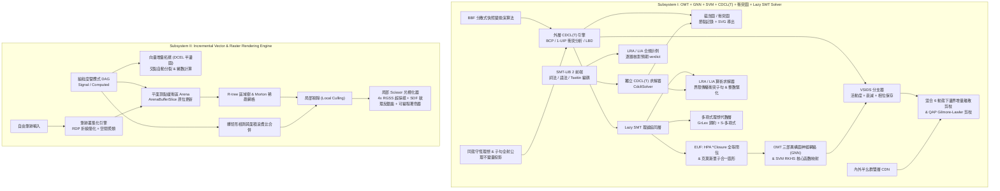

# MoonBit Unified Engine: OMT + GNN + SVM + CDCL(T) + 衝突圖 + Lazy SMT Solver & Incremental Vector/Raster Rendering System

[](https://www.moonbitlang.com)
[](LICENSE)
[](#快速開始與測試)

本倉庫以 **MoonBit** 語言及官方標準庫 (`moonbitlang/core`) 實現兩大核心引擎：

1. **自研 OMT 內層 + GNN / SVM 啟發式 + CDCL(T) 外層嵌入 Lazy SMT 統一求解器**
   - 內層 OMT 聯動 **SVM 再生核希爾伯特空間 (RKHS) 核心函數映射**、**HPA 線性時間全等閉包 (`*Closure`)**、**克萊斯合一圖形 (Kleisli Unification Graph, EUF)** 與 **BBF 分散式快照變換演算法**
   - **VSIDS 分支啟發式 + 相位保存 (Phase Saving)**：變數活動度每衝突衰減 0.95、超過 1e100 自動重新縮放；GNN / SVM 負責平手排序同極性預測
   - **CDCL(T) 蘊含圖 / 衝突圖 (`ImplicationGraph`)**：逐步記錄決策同傳播節點，導出真實 **SVG** 圖（決策藍、傳播綠、衝突路徑紅），並且 1-UIP 分析由 OMT 引擎同獨立 CDCL(T) 求解器共用同一份實作
  - **LBD 認證 (`distinct_decision_levels`)**：每條學習子句嘅 LBD 都用學習當刻嘅 decision level 重新計算核對，唔會出現「寫入後冇人驗證」嘅統計值
   - **獨立 CDCL(T) 求解器 (`CdcltSolver`) + SMT-LIB 2 前端 (`parse_smtlib`)**：由 `(set-logic QF_LIA)`、`(declare-const …)`、`(assert …)`、`(check-sat)`、`(get-model)` 腳本直接求解，並附 **LRA / LIA 合規示例**（教科書 / 教程常見腳本，逐題核對預期結果）
   - **內外半幺群雙層 CDN 解耦對映 QAP 指派子句 CNF**、**混合 6 動態下邊界增量離散剪枝**、**QAP 增量離散剪枝** 與 **增量最優解引理（記錄 incumbent 並加 blocking clause；唔係最小解釋）**
   - **同態守恆理想** 與 **疊加協同窮舉上界歸因子句全射公理不變量約束投影**，並保留 **多項式理想歸約 (GrLex + S-多項式)** 代數層
   - 完整支援 **Lazy SMT + LRA (線性實數算術) + LIA (線性整數算術) + EUF (未解釋函數等詞)**

2. **高性能向量增量拓撲與細粒度局部光柵渲染系統**
   - **向量增量拓撲 (DCEL 半邊平面圖)**、**細粒度響應式（dirty 標記推送 + 依賴序重算）**
   - **動態 R-tree 區域樹**、**Morton Z-Order 稀疏網格**、**筆跡叢集化 (RDP 簡化 + 空間切向親和聚類)**、**髒矩形檢測與面積浪費比合併**
   - **平面頂點緩衝區 (Flat VBO/IBO Arena)**、**雙線性插值 SDF 有向距離場紋理圖集**、**可編程頂點/片段著色器**
   - **局部剔除 (Local Culling)**、**4x RGSS 旋轉網格超採樣 + SDF 邊緣平滑反鋸齒** 與 **幀間增量渲染管線**

> **本次重構（2026-10）**：環升態圓柱代數覆蓋 (CAC) 已完全刪除（連同 `CacIdealReductionAxiom` 公理分類同場景 [3]）；協同 LRB 分支器亦已刪除，分支次序改由 **VSIDS** 決定。舊模組 `lrb_qap_pruning.mbt` / `cac_ideal_and_invariants.mbt` 分別由 `hybrid6_qap_pruning.mbt` / `poly_ideal.mbt` 取代。

---

## 系統架構總覽



---

## 專案目錄與模組說明

```text
.
├── moon.mod                         # MoonBit 模組設定檔
├── moon.pkg                         # 根套件依賴設定
├── solver_tunables.mbt              # 集中數值參數 (sentinels / tolerances / budgets / VSIDS / GNN / 布局常數)
├── types_and_algebra.mbt            # 布爾/算術基礎型別、內外半幺群雙層 CDN 解耦映射、QAP 指派 CNF 生成
├── euf_hpa_kleisli_bbf.mbt          # HPA 線性時間 *Closure 全等閉包、Kleisli 範疇合一圖、BBF 分散式快照
├── gnn_svm_kernel.mbt               # OMT 異構圖神經網絡 (GNN) 消息傳遞、SVM RKHS 高斯/多項式/EUF 混合核
├── vsids_oracle.mbt                 # VSIDS 活動度、衰減、重新縮放、相位保存、GNN 特徵正規化
├── conflict_graph.mbt               # 蘊含圖 / 衝突圖記錄與 SVG 導出、OMT 與 CDCL(T) 共用的 1-UIP 分析
├── smtlib_frontend.mbt              # SMT-LIB 2 詞法分析 + 遞迴下降語法分析 (set-logic/declare-const/assert/check-sat/get-model)
├── cdclt_solver.mbt                 # Tseitin 編碼 + 獨立 CDCL(T) 求解器 (VSIDS + 理論檢查 + 學習子句 + 模型輸出)
├── compliance_scenarios.mbt         # LRA / LIA 合規示例報告 + 衝突圖場景 (SVG)
├── poly_ideal.mbt                   # 多元多項式 (GrLex)、理想除法歸約、S-多項式、同態守恆理想、全射公理投影
├── hybrid6_qap_pruning.mbt          # 混合 6 動態下界、QAP 增量離散剪枝、自適應最優解引理
├── lazy_smt_omt_solver.mbt          # LRA/LIA 求解器、Lazy SMT + CDCL(T) + OMT 主引擎 (VSIDS + 衝突圖)
├── render_topology_reactive.mbt     # 向量增量拓撲 (DCEL 半邊圖、交點分裂) 與細粒度響應式依賴圖
├── render_spatial_rtree_grid.mbt    # 動態 Guttman R-tree、Morton 稀疏網格、RDP 筆跡叢集化、髒矩形合併
├── render_vbo_sdf_shader.mbt        # 平面 VBO/IBO 緩衝區、雙線性 SDF 紋理圖集、可編程頂點/片段著色器
├── render_rasterizer_pipeline.mbt   # 局部剔除、局部 Scissor 光柵、4x RGSS 反鋸齒、增量渲染主引擎
├── omt_cdcl_solver.mbt              # 端到端基準場景編排入口 (OMT / QAP+Hybrid6 / LRA-vs-LIA / 渲染)
├── omt_cdcl_solver_wbtest.mbt       # 白盒單元測試 (代數同態、HPA/Kleisli、GNN/SVM、VSIDS、1-UIP、蘊含圖…)
├── omt_cdcl_solver_test.mbt         # 黑盒整合測試 (場景 + SMT-LIB 前端 + CDCL(T) 求解器 + 合規示例)
└── cmd/main/
    ├── moon.pkg                     # CLI 執行檔套件設定
    └── main.mbt                     # CLI 主程式：場景 [1]–[6]（含合規報告同衝突圖 SVG）輸出遙測報告
```

---

## 核心演算法細節

### 1. OMT + GNN + SVM + VSIDS + CDCL(T) + Lazy SMT 求解器

- **VSIDS 分支 (`VsidsOracle`)**：每個變數一個活動度分數；每個衝突按 1-UIP 分析收集到嘅參與變數加 `var_inc`，之後 `var_inc /= 0.95`；活動度總量超過 `1e100` 就整體除以 `var_inc` 重新縮放（保留排序、避免溢出）。相位保存記錄每個變數上次賦值極性，OMT 記錄新 incumbent 之後會提示「降低成本」嘅極性（正權重且曾經為 True 嘅變數下次試 False）。
- **蘊含圖 / 衝突圖 (`ImplicationGraph`, `ConflictNode`)**：決策同傳播每次入隊都記錄節點（決策無 reason；傳播節點記 reason 子句索引同**已賦值**嘅前驅文字），衝突時標紅；`verify()` 重檢所有節點層級同前驅關係，`all_lits_justified()` 檢查學習子句每個文字係否被圖中賦值證成；`to_svg()` 按決策層分欄輸出 SVG。OMT 引擎同 `CdcltSolver` 都用同一份記錄。
- **共用 1-UIP 分析 (`analyze_conflict_1uip_from_trail`)**：OMT 引擎嘅 `analyze_conflict_1uip` 只係薄封裝，兩部求解器唔會再各自漂移。
- **SMT-LIB 2 前端 + 獨立 CDCL(T) 求解器 (`parse_smtlib`, `CdcltSolver`)**：前端支援 `set-logic` / `declare-const`（Bool / Int / Real）/ `assert` / `check-sat` / `get-model` / `exit`，其餘命令按括號平衡跳過並記錄喺 `unsupported_commands`；唔識嘅 sort、未知符號、非線性乘法都係硬錯誤（回傳 `None`，唔會靜靜當真）。編碼器把 `and/or/not/=>/=` 同比較算子 Tseitin 化成 CNF，算術原子註冊到 LRA/LIA 理論求解器（`not` 保留精確補關係；`=` 用 `≤ ∧ ≥` 加 `≠` 嘅 case-split 編碼，整數用 `rhs ± 1`）。求解循環 = BCP → 理論檢查 → VSIDS 決策，衝突經 1-UIP 學習回溯，模型要有理論證書（`witness_certified`）先算 sat，否則回報 `unknown` 而唔會假裝找到答案。`get-model` 輸出 `define-fun` 行。
- **LRA / LIA 合規示例 (`compliance_scenarios.mbt`)**：9 條腳本涵蓋教程相對次序、區間界限、`Int` vs `Real` 嘅整數割分離（`[1.4, 1.6]`、`2x = 1`）、等式加界限矛盾、布爾結構餵理論等；報告逐題印 `expected … got … [OK/MISMATCH]`，任何一題唔對就唔會靜靜當過。
- **內外半幺群雙層 CDN 解耦對映 (`DualLayerCDN`)**：外層布爾部分指派幺半群 $(\mathcal{M}_{\text{outer}}, \oplus, e_{\text{outer}})$ 到內層理論狀態半群 $(\mathcal{S}_{\text{inner}}, \otimes)$ 滿足同態律 $\Phi_{\text{CDN}}(\mathbf{a} \oplus \mathbf{b}) = \Phi_{\text{CDN}}(\mathbf{a}) \otimes \Phi_{\text{CDN}}(\mathbf{b})$。
- **HPA `*Closure` 與克萊斯合一圖形 (`HpaCongruenceClosure`, `KleisliUnificationGraph`)**：支援任意深度未解釋函數嵌套 $a \equiv^* b \implies f(f(a)) \equiv^* f(f(b))$ 嘅線性時間傳播與證明森林路徑追蹤（`explain_path` 回傳 sound 超集，非最小解釋），並在代換單子 Kleisli 範疇 $\mathcal{K}(T)$ 中透過 `occurs_in` 攔截非良基循環合一。
- **混合 6 動態下邊界 (`Hybrid6DynamicLowerBound`)**：融合 $LB_1$（LRA 連續鬆弛）、$LB_2$（LIA 整數緊化）、$LB_3$（QAP Gilmore-Lawler 下界）、$LB_4$（SVM RKHS 譜範數下界）、$LB_5$（EUF 全等耦合下界）、$LB_6$（GNN 校準神經下界）進行增量離散剪枝。$LB_4$–$LB_6$ 係校準啟發式，只會將融合下界收緊到唔超過 $LB_1$–$LB_3$ 嘅合理下界；真正決定剪枝嘅係後三者。
- **同態守恆理想與全射公理投影 (`HomomorphicConservationIdeal`, `SurjectiveAxiomProjector`)**：在布爾商環 $R[x_1,\dots,x_n]/\langle x_i^2 - x_i\rangle$ 上驗證歸結步同學習子句嘅守恆性，並校驗 8 類公理來源嘅全射覆蓋；認證失敗次數同各類覆蓋率會經 CLI 報告輸出（正常失敗次數為 0）。
- **多項式理想代數層 (`poly_ideal.mbt`)**：$\mathbb{Q}[x_1,\dots,x_n]$（GrLex 序）上嘅歸一化、多元理想除法歸約、Buchberger S-多項式同區間求值；呢層係獨立代數工具，唔再綁定任何求解器內迴路。

### 2. 向量增量拓撲與增量光柵渲染系統

- **向量增量拓撲 (`VectorTopologyGraph`)**：插入新線段時自動檢測與既有活躍半邊的內部交點，原位分裂半邊對 (`split_edge_incremental`) 並維護平面圖繞數。
- **細粒度響應式與平面 VBO (`FineGrainedReactiveGraph`, `FlatVertexArena`)**：單一圖元平移信號觸發時，直接對 `ArenaBufferSlice` 對應的連續浮點陣列區間執行原位更新 (`translate_slice_in_place`)，唔需要重新上載或者重新分配切片。
- **R-tree + Morton 稀疏網格局部剔除與局部 Scissor 光柵 (`IncrementalRenderEngine`)**：合併新舊包圍盒為緊湊髒矩形後，求取 R-tree 與稀疏網格查詢交集以剔除髒區外圖元，並僅在髒矩形 Scissor 視窗內執行 **4x RGSS 旋轉網格超採樣 + SDF 雙線性平滑反鋸齒** 光柵化。

### 3. 誠實聲明與已知限制

以下如實記錄能力邊界，避免文檔描述超越實現：

- **本次重構冇 MoonBit 工具鏈可用**：所有驗證都係靜態檢查（grep 殘留引用、mbti 對照、括號/字串平衡掃描、Python 複刻關鍵算法），**未執行過 `moon check` / `moon test` / `moon run`**。首次在裝好工具鏈嘅環境跑之前，請先 `moon check`。
- **LB4 / LB5 / LB6（SVM 譜範數、EUF 耦合、GNN 校準）係啟發式**：三者都會被夾在 LB1–LB3 構成嘅可靠下界之內，所以 `fused_lower_bound` 永遠唔會超過可靠上確界，剪枝保持 admissible；亦因為咁，實際決定剪枝嘅只有 LB1、LB2 同 LB3，LB4–LB6 只作遙測輸出。
- **算術理論求解器係區間界限傳播**，唔係 simplex；衝突子句由界限嘅 reason 集合（已做傳遞閉包）同約束 guard 構成。標籤為 `LraFarkasAxiom` 嘅只係「實數界限衝突」分類，程式**冇**構造或驗證顯式 Farkas 證書。
- **VSIDS / GNN / SVM 係固定權重啟發式**（GNN 同 SVM 冇訓練）：VSIDS 決定分支**次序**，GNN / SVM 決定**平手**同極性預測；兩者都唔影響健全性。
- **SMT-LIB 前端只覆蓋 QF_LRA / QF_LIA 片段**：`declare-fun`、未解釋函數、非線性乘法、陣列、量詞一律係硬錯誤或者跳過嘅命令；`unsupported_commands` 會列出跳過咗嘅命令。`get-model` 輸出係 `define-fun` 行，並非逐字節 SMT-LIB 標準模型格式。
- **Dual-Layer CDN 對映 (`map_outer_to_inner`)** 係對外 API，由白盒測試驗證同態律；求解器主搜尋流程只寫入註冊表、冇讀返映射結果，因此唔影響搜尋路徑。
- **BBF 快照係單進程內嘅求解器狀態副本**（union-find、界限、incumbent）；一致割檢查會驗證森林結構同比界非空，但唔係跨節點嘅分散式算法。
- **渲染系統**：`RTree::update_primitive_aabb` 係 O(N) 全樹掃描（未維護 primitive→leaf 索引）；`SparseSpatialGrid::coord_to_tile` 保留 signed tile index（負座標唔會再夾入 tile 0；`morton_encode_2d` 只係將 hash 輸入夾到 0..16383，桶碰撞由 `(tile_x, tile_y)` 精確比對區分，所以查詢仍然 sound）；局部剔除取 R-tree ∩ 網格結果，網格只作 superset 過濾；頂點著色器嘅 `Affine2D` transform 目前只由白盒測試驅動，引擎未提供 setter。

---

## 快速開始與測試

### 1. 安裝 MoonBit 工具鏈
```bash
curl -fsSL https://cli.moonbitlang.com/install/unix.sh | bash
export PATH="$HOME/.moon/bin:$PATH"
```

### 2. 靜態檢查、格式化與單元/整合測試
```bash
moon check
moon test
```

### 3. 執行主程式基準演示
```bash
moon run cmd/main
# 想保存衝突圖：把 "----- BEGIN CONFLICT GRAPH SVG -----" 同
# "----- END CONFLICT GRAPH SVG -----" 之間嘅輸出寫入 .svg 檔即可。
```

### 4. 標準輸出節錄（示意，數字以實際執行為準）
```text
Total tests: 18, passed: 18, failed: 0.
================================================================================
  MoonBit Self-Developed OMT + GNN + CDCL(T) + Lazy SMT Unified Solver Engine
================================================================================

[1] Lazy SMT + CDCL(T) + LRA + LIA + EUF (HPA *Closure & Kleisli) + OMT:
    - Satisfiable                    : true
    - Optimal Objective Value        : 15
    - Best Arithmetic Witness (x0,x1): (2, 3)
    - CDCL(T) Conflicts / Decisions  : 1 / 4
    - Implication Graph Nodes        : 4 decisions / 6 implied (violations: 0)
    - VSIDS Activity Rescalings      : 0
    - LBD Certification Failures     : 0
    - Conservation Ideal Verified    : true

[3] SMT-LIB 2 Compliance Examples (LRA / LIA) via the in-tree front-end + CDCL(T) solver:
=== SMT-LIB 2 compliance examples: LRA / LIA fragment ===

--- lia-relative-order ---
  verdict : expected sat, got sat [OK]
--- lia-integrality-cut ---
  verdict : expected unsat, got unsat [OK]
--- lra-same-interval ---
  verdict : expected sat, got sat [OK]
--- lia-odd-equality ---
  verdict : expected unsat, got unsat [OK]
--- lra-dyadic-equality ---
  verdict : expected sat, got sat [OK]
--- cdclt-boolean-theory-sat ---
  verdict : expected sat, got sat [OK]

9 / 9 examples matched their expected verdict.

[4] CDCL(T) Implication / Conflict Graph:
  verdict        : unsat (expected unsat)
  conflicts      : 1
  graph verify   : true (0 violation(s))
  LBD certification: 0 failure(s)
----- BEGIN CONFLICT GRAPH SVG -----
<svg xmlns='http://www.w3.org/2000/svg' …>…</svg>
----- END CONFLICT GRAPH SVG -----
================================================================================
```

> 註：以上係節錄（省略咗場景 [2] / [5] / [6] 同各題模型 / 遙測行）。衝突、決策、傳播次數
> 取決於啟發式搜尋路徑；黑盒測試斷言嘅目標值（場景 [1] 15、場景 [2] 30、場景 [4] 11 等）
> 保持不變。

---

## 輸出節錄

上面嘅 console block 係 `moon run cmd/main` 輸出嘅節錄（並非逐行完整貼上）。實際上每個場景仲會
印出 **公理認證失敗次數**（`Axiom Certification Failures`，正常為 0）同 **8 類公理來源覆蓋率**
（`Axiom Schema Coverage: n / 8 categories`）；呢兩個數字係 `SurjectiveAxiomProjector` 嘅
`schema_coverage_report()` 讀數。衝突圖 SVG 會喺 `[4]` 段落用 `BEGIN/END` 標記包住輸出，
可以整段複製成 `.svg` 檔案直接用瀏覽器打開。

---

## 授權條款 (License)

本專案採用 [Apache-2.0 License](LICENSE) 授權。
